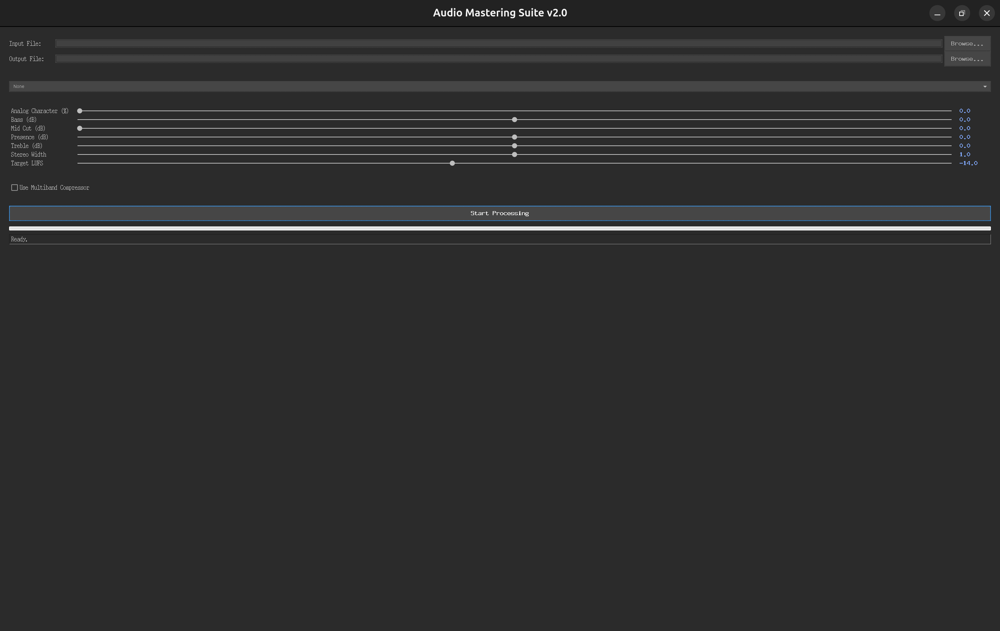

# Python Audio Mastering Suite v2.0

A professional-grade, local desktop application for mastering audio files. Built with Python and a modern Tkinter GUI, this tool provides a complete, feature-rich mastering chain designed for musicians, producers, and DJs who want to add a final layer of polish to their tracks.

This application is the stable, local version of the project. A future release is planned to transition this engine to a scalable, cloud-native web application on Google Cloud Platform.




---

## Features

This suite goes beyond basic audio processing, incorporating advanced features for professional-grade results:

-   **Intuitive Graphical Interface:** A clean, dark-themed UI built with Tkinter that provides real-time control over all parameters without touching the command line.
-   **Upgraded Mastering Engine:**
    -   **Analog Character Control:** A single, powerful knob that intelligently blends harmonic saturation, a gentle sub-bass "bump," and a high-end "sparkle" to add vintage analog warmth and mojo.
    -   **Phase-Coherent Multiband Compressor:** A re-architected 3-band compressor that avoids phase cancellation issues, ensuring a tight, punchy, and clean sound. Features detailed controls for threshold and ratio on each band.
    -   **Professional EQ & Widening:** A full 4-band equalizer and a stereo widener to shape the tonal balance and spatial image of your mix.
-   **Streaming-Ready Loudness:** Utilizes **LUFS (Loudness Units Full Scale)** normalization to target the consistent, balanced loudness levels required by modern streaming platforms like Spotify and Apple Music.
-   **Robust & Efficient:** Handles audio files of any size by processing them in manageable chunks, with a progress bar for real-time feedback. The processing is run in a background thread to keep the GUI responsive.
-   **CD-Quality Export:** Final masters are exported to a professional, standard **16-bit / 44.1kHz WAV format** to ensure high quality without unnecessarily large file sizes.

---


```bash
# Create a new environment named "audio_env" with Python 3.11
conda create -n audio_env python=3.11
